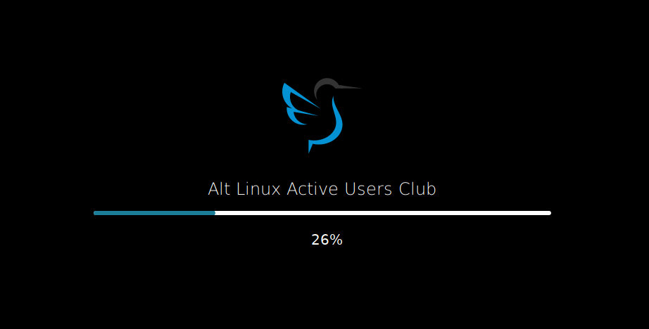

# Plymouth theme altclub lxqt

**Source Code:** https://github.com/Koi-foo/kernel-manager.git

## Summary:
Plymouth "LXQT" theme

## Description:
Theme for the lxqt desktop loading screen.

## Install

* Recommended installation to /opt directory

## Changelog
* New version v1.0 Release

## Preview

  

